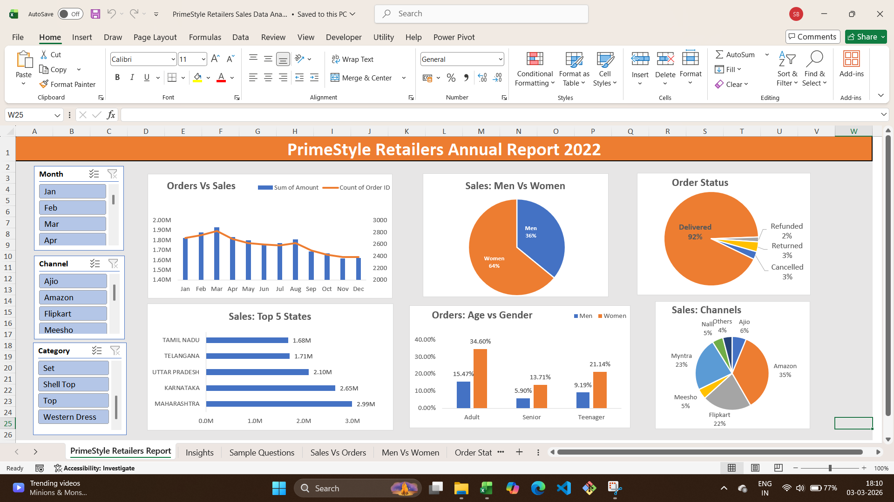

# PrimeStyle Retailers Annual Report 2022 (Excel Dashboard)

## 📌 Overview
This project analyzes **PrimeStyle Retailers’ 2022 sales data** and presents insights through an interactive **Excel dashboard**.  
The dashboard was built using **PivotTables, PivotCharts, and Slicers** without any VBA/Macros.  
It answers key business questions such as:
- Which month had the highest sales?
- Who contributed more to sales: Men or Women?
- Which states and channels performed best?
- What is the relation between age and gender based on orders?
- Which channel is contributing maximum sales?

---

## 🎯 Steps Taken
1. **Data Cleaning**  
   - Filtered raw data to remove inconsistencies.  
   - Ensured proper formatting for sales records.  

2. **Data Processing**  
   - Added calculated columns:  
     - **Month** (to analyze monthly sales trends)  
     - **Age Group** (to compare sales across Men/Women and age categories)  

3. **PivotTables & Charts**  
   - Created 6 Pivot Charts:  
     - Sales & Orders (monthly trend)  
     - Gender-wise Sales (Men vs Women)  
     - Delivery Status (Delivered, Returned, Refunded, Cancelled)  
     - Top 10 States by Sales  
     - Age vs Gender Orders  
     - Sales Share by Channel  

4. **Interactive Slicers**  
   - Added 3 slicers: **Month, Category, Channel**  
   - Connected slicers across all charts for dynamic filtering.  

5. **Dashboard Design**  
   - Combined charts and slicers into a single interactive dashboard.  
   - Ensured clarity, readability, and professional layout.  

---

## 📊 Key Insights
- Women are more likely to buy compared to men (~65%).  
- Maharashtra, Karnataka, and Uttar Pradesh are the top 3 states (~35%).  
- Adult age group (30–49 yrs) contributes the maximum (~50%).  
- Amazon, Flipkart, and Myntra channels contribute the most (~80%).  

### 📌 Final Conclusion
To improve **PrimeStyle Retailers’ sales**, target **women customers aged 30–49 years** living in **Maharashtra, Karnataka, and Uttar Pradesh** by showing ads/offers/coupons available on **Amazon, Flipkart, and Myntra**.

---

## 🖼️ Dashboard Preview

---

## 📂 Files Included
- `PrimeStyle_Retailers_Annual_Report_2022.xlsx` → Main Excel dashboard  
- `README.md` → Documentation and usage guide  
- `dashboard.png` → Screenshot of the dashboard  
- `Insights.pdf` → Business insights and recommendations  
- `Sample-Questions.pdf` → Key analysis questions answered in the dashboard  

---

## 🔗 Project Access
- [View Documentation on GitHub](https://github.com/bhagwan48/PrimeStyle-Retailers-Annual-Report-2022)  
- [Download Excel File (Google Drive)](https://docs.google.com/spreadsheets/d/1glrXbUtPQs7kNXhlQwDfr7Z0LdBtx8D8/edit?usp=sharing&ouid=106769008347225894565&rtpof=true&sd=true)  
- [Alternative Access (OneDrive)](https://1drv.ms/x/c/abf38e055018001c/IQAaq3sOPgSTRaWYPo0dRC_3AbxJ5PNv0WpICIjZbbPXops?e=jXeRXs)  

---

## 📜 License
This project is licensed under the MIT License – see the LICENSE file for details.

### 🔎 What this means
- Anyone can **use, copy, modify, or merge** this project in their own work.  
- The project can be **shared or even sold**, but proper credit to the original author (Shri Bhagwan Pathak) is required.  
- No one can directly change this GitHub repository without the owner’s approval.  
- The software is provided **“as is”**, without any warranty or liability on the author.  

---

## 📧 Contact
For any queries, feel free to connect via LinkedIn: [linkedin.com/in/bhagwan48](https://www.linkedin.com/in/bhagwan48/)
